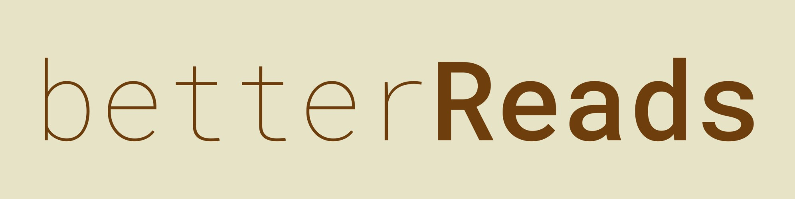

## Introduction

[GoodReads](https://www.goodreads.com/). A place where people like looking at scribbles on a bunch of **paper**-thin pieces of processed wood. A place where you express your feeling about scribbles in plain text. Because, in order to be expressive... you need to know how to hack NASA with HTML.

## What is [HTML](https://developer.mozilla.org/en-US/docs/Web/HTML)?

**GoodReads** allows HTML formatting. ***What's that?*** Google it...

### GoodReads Formatting Tips

Goodreads allows some html [formatting](https://help.goodreads.com/s/article/How-do-I-format-text-into-html-1553870934599).

So, What's [that](https://www.merriam-webster.com/dictionary/that)?

Now, **HTML** is a hard, very complex, impossible to learn **PROGRAMMING LANGUAGE**. That only computer nerds know how to speak. Even Albert Einstein had no clue about it.

Now, you may ask. How would you (*not Albert Einstein*) format your **WORDS OF WISDOM**? Fear not, for I'm always Right. Even when I'm **rong**.

## Why am I here?

I ask myself that everyday...

## Why are you here?

I don't know, you tell me.

## What's **BetterReads**?

*It will be* a browser extension that you can install on your microwave...

> **Disclaimer**: Don't install BetterReads on your microwave. It may come to life, start reading books, gain knowledge and take over the world.

## What does it do?

It will surround the selected text with `<b>...</b>` if you want to blob the text (*and all the other formatting options*)...

> How would you un-blob the text?

**Time travel**. Have't made that part, I have a life... Ok that was a lie.

### Underdevelopment

For now, Only the cool people with [Firefox](https://www.mozilla.org/en-US/firefox/new/) (*other will come soon*) can **TEST** the extension, that will make GoodReads review formatting **BETTER**.

## What's next?

- Add Link
- Add Image
- If a formating tag is selected and that format button is pressed. It will remove that format...
- Make it Better.
- In the far future, it will have a full MS word style word processor.

